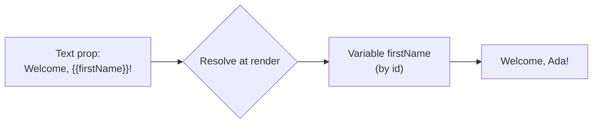

# Bindings, Variables & Functions

**Bindings** put live values into your content. Instead of hard-coding text, you reference
a variable, a function result, or a dataset field, and Aglyn resolves it when the page
renders.

:::info Plan availability
**Free** to start, with plan caps on the number of variables, functions, and workflows.
:::

## Binding tokens

Bindings appear inside text props as tokens:

| Token | Resolves to |
| --- | --- |
| `{{name}}` | A host **variable**. |
| `{{fn:name(args)}}` | The result of a **function**. |
| Dataset field bindings | A value from a [dataset](../datasets/overview.md) record. |

The Besigner resolves bindings **WYSIWYG** on the canvas and marks bound content so you can
see what's dynamic.

## Rename-safe id tokens

Bindings reference variables and functions **by id**, not by name. That means renaming a
variable doesn't break anything that uses it. Legacy name-based tokens still resolve via a
fallback, and imports are normalized to id form automatically. When you publish, older
documents are migrated to id tokens.

## Insert bindings without typing

Use the **insert-binding picker**: search by friendly name, pick a variable or function,
and the correct id token is inserted for you.

## Typed variables

Create **typed host variables** and reference them as `{{name}}` in any prop. Types keep
values consistent across the site.

## No-code functions

Build **functions** in the in-editor function builder with a safe evaluator — no arbitrary
code execution. Compose variables and other functions, and call them inline with
`{{fn:name(args)}}`.

## Where-used & safety

Before you rename or delete a variable or function, run the **where-used scan** to see
every screen and prop that references it, so changes are safe.

## Workflows

Variables and functions compose into **workflows** — multi-step logic triggered by host
events. See [Workflows & actions](../workflows-and-actions/overview.md).

## Related

- [Datasets](../datasets/overview.md)
- [The Besigner](../besigner/overview.md)
