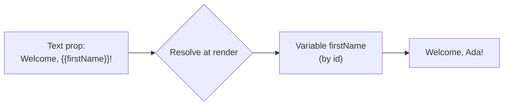

# Bindings, Variables & Functions

**Bindings** put live values into your content. Instead of hard-coding text, you reference
a variable, a function result, or a dataset field, and Aglyn resolves it when the page
renders.

:::info Plan availability
**Free** to start, with plan caps on the number of variables, functions, and workflows.
:::

## Binding tokens

Bindings appear inside text props as tokens:

| Token | Resolves to |
| --- | --- |
| `{{name}}` | A site **variable**. |
| `{{fn:name(args)}}` | The result of a **function**. |
| Dataset field bindings | A value from a [dataset](../../content-and-data/datasets/overview.md) record. |

The Besigner resolves bindings **WYSIWYG** on the canvas and marks bound content so you can
see what's dynamic.

## Rename-safe id tokens

Bindings reference variables and functions **by id**, not by name. That means renaming a
variable doesn't break anything that uses it. Legacy name-based tokens still resolve via a
fallback, and imports are normalized to id form automatically. When you publish, older
documents are migrated to id tokens.

## Insert a variable

You never have to hand-type token syntax. Every text-capable attribute field in the
Besigner (Text, Link URL, Image URL, …) has a small **`{x}` insert button** at its end.
Click it to open the **data picker** — a searchable menu grouped by source:

| Group | Tokens | When it appears |
| --- | --- | --- |
| **Variables** | Your site variables (inserted as rename-safe id tokens) | When the site has variables |
| **Functions** | Your functions, with parameter placeholders | When the site has functions |
| **Entry** | Collection-entry fields — Title, Excerpt, Link URL, Published date, … | Always (hint shows where they resolve) |
| **Collection** | Collection name and slug | Always (resolves on collection pages) |
| **Dataset item** | The fields of the repeated dataset, by display name | Only inside a repeating container |

Picking an option inserts the token **at your cursor**, keeping the text around it — so
you can compose values like `Read “{{entry.title}}” →` or
`https://example.com/blog/{{entry.slug}}` by mixing typed text and inserted placeholders.
Pick again to keep concatenating; the cursor lands right after each inserted token. Each
variable option shows a **live value preview** so you can confirm what the binding
resolves to before inserting it.

Selected text is replaced by the inserted token, and the element-level **Insert binding**
button on text elements opens the same picker (appending to the element text).

### Token pills

Placeholders never show up as raw `{{...}}` syntax while you edit — each one renders
as a small **colored pill** carrying the binding's *current display name*. Variables,
functions, entry fields, collection fields, and dataset items each get their own
stable color, so a glance tells you what kind of data a pill resolves to. Under the
hood the stored value still keeps the rename-safe **id token**: the pill is pure
presentation, which is why renaming a variable instantly relabels every pill without
touching your content.

- **Click a pill** to act on it: **Replace** reopens the data picker and swaps the
  token in place, **Remove** deletes it from the text.
- A pill whose referent no longer exists (a deleted variable, an unknown token)
  renders in a warning color, with the raw token as its tooltip.
- Typing raw `{{...}}` by hand still works — the token becomes a pill when the
  field loses focus.

### In the canvas text editor

Double-clicking a text element opens the inline text editor right on the canvas —
and it speaks pills too. Existing tokens render as pills the moment the editor
opens, the toolbar's **`{x}` button** opens the same grouped data picker (with the
element's own context: dataset items inside repeating containers, entry fields
inside Collection entries blocks), and clicking a pill offers the same
Replace/Remove. Rich-text elements keep their formatting toolbar — pills sit inline
with bold, italic, links, and lists, and everything serializes back to plain token
syntax when the edit commits.

:::tip Advanced: type it raw
The picker is a convenience, not a requirement — typing `{{...}}` tokens by hand keeps
working everywhere, and typed `{{name}}` tokens are normalized to rename-safe id form on
save.
:::

Everywhere else the console references logic by entity, it uses **pickers that store
ids**, never typed names: workflow steps pick their function, automations pick their
workflow/dataset/webhook, and computed variables pick their workflow. Renaming an
entity never breaks anything that references it — the display name is just a label.

## Typed variables

Create **typed site variables** and reference them as `{{name}}` in any prop. Types keep
values consistent across the site.

## No-code functions

Build **functions** in the in-editor function builder with a safe evaluator — no arbitrary
code execution. Compose variables and other functions, and call them inline with
`{{fn:name(args)}}`.

## Where-used & safety

Before you rename or delete a variable or function, run the **where-used scan** to see
every screen and prop that references it, so changes are safe.

## Workflows

Variables and functions compose into **workflows** — multi-step logic triggered by site
events. See [Workflows & actions](../../marketing-and-automation/workflows-and-actions/overview.md).

## Related

- [Datasets](../../content-and-data/datasets/overview.md)
- [The Besigner](../besigner/overview.md)
