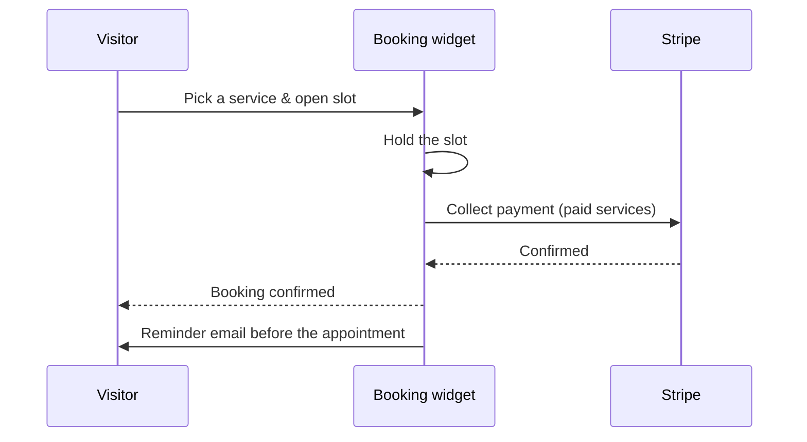

# Bookings & Scheduling

**Bookings** turn your site into a scheduling tool: define services, publish your
availability, and let visitors book time — with optional payment and automatic reminders.

:::info Plan availability
**Paid**. Paid bookings use Stripe; reminder emails are included.
:::

## Set up bookings

1. Define **services** (what can be booked, duration, price).
2. Configure **availability** — the windows when slots are offered.
3. Add the **booking widget** to a screen as a canvas element.

## Taking bookings

- Visitors pick a slot through the booking widget; the **booking API** records it.
- For paid services, Stripe collects payment and a **slot hold** prevents double-booking
  during checkout.
- **Reminder emails** go out automatically ahead of the appointment.

## Manage

Use the console **bookings** page to see and manage upcoming appointments.

## Related

- [Commerce](../commerce/overview.md)
- [Email campaigns](../../marketing-and-automation/email-campaigns/overview.md)
