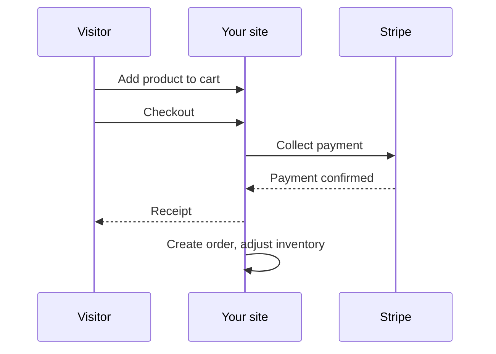

# Commerce

Aglyn's **commerce** features let you sell directly from your site — add products, drop a
product block on a screen, take payment at checkout, and manage what comes after the sale.

:::info Plan availability
**Paid**. Selling requires a paid tier; payments run through Stripe.
:::

## Starter selling

1. Create **products** with pricing.
2. Add the **product block** to a screen in the Besigner.
3. Visitors buy through **checkout**; completed purchases become **orders**.

## Commerce v2

Beyond the basics, commerce v2 adds:

- **Receipts** for completed orders.
- **Inventory** tracking.
- **Coupon codes** for discounts.

## Manage orders

The console **orders** page supports **filters** and **CSV export**, so you can reconcile
sales and pull data into other tools.

## Related

- [Bookings & scheduling](../bookings/overview.md) (for services and appointments)
- [Billing & plans](../billing-and-plans/overview.md)
