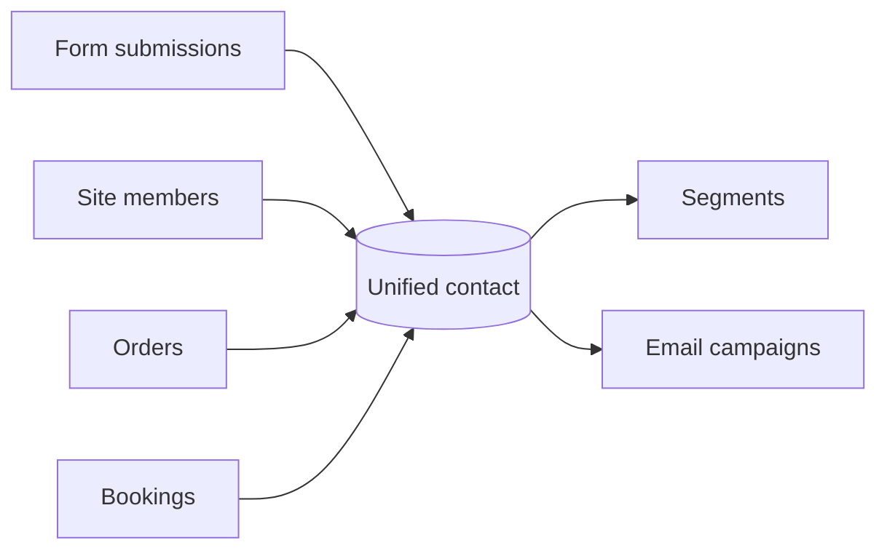

# Contacts CRM

The **Contacts CRM** is a single list of the people who interact with your site. Aglyn
builds it automatically from everything they do, so you always have an up-to-date view of
your audience.

:::info Plan availability
**Paid**. Contacts power [email campaigns](../email-campaigns/overview.md) and segments.
:::

## Unified ingestion

Contacts are ingested from across your site:

- [Form](../forms/overview.md) submissions
- Site **members** (sign-ups)
- **Orders** from [commerce](../commerce/overview.md)
- **Bookings** from [scheduling](../bookings/overview.md)

Duplicate signals from the same person are unified into one contact.

## The contacts page

- Browse the **list** of contacts.
- Open a **profile drawer** to see a contact's details and history.
- Add **tags** and **notes**.
- **Export to CSV**.

## Segments

Group contacts into **segments** — reusable audiences you can target directly in
[email campaigns](../email-campaigns/overview.md).

## Related

- [Email campaigns](../email-campaigns/overview.md)
- [Forms & lead capture](../forms/overview.md)
