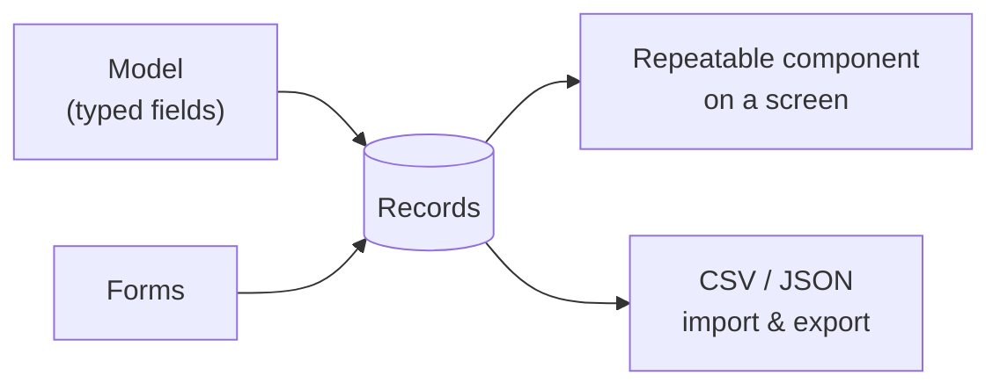

# Datasets & Dynamic Content

**Datasets** are your structured content: a typed **model** plus the **records** that fill
it. Screens read from datasets to render dynamic, repeatable content, and
[forms](../forms/overview.md) write new records back in.

:::info Plan availability
**Pro**. Free hosts get a limited number of datasets; Pro and above raise the cap, and
extra-dataset add-ons are available.
:::

## Model builder

Define a model in the schema dialog with **typed fields** (text, number, date, reference,
and more). The model comes from the host's `dod.ts` blueprint at runtime, so records are
validated against it.

## Typed documents

Edit records in the **typed document editor** — each field renders the right input for its
type, so data stays clean.

## Relations

Fields can **reference** other records, including **many-to-many** relations, letting you
model real structures (posts ↔ authors, products ↔ categories).

## Query layer

A **dataset query layer** powers both the editor and screen bindings, so the same data is
available to design-time previews and the live site.

## Repeatable components

Bind a component over a dataset to repeat it per record — a list, grid, or gallery driven
by your data. The Besigner shows a **repeat badge** so you know a component is data-driven.

## Import & export

Datasets round-trip via **CSV and JSON**: export your records, edit them elsewhere, and
re-import with validation on the way in.

## Related

- [Forms & lead capture](../forms/overview.md)
- [Bindings, variables & functions](../bindings/overview.md)
- [Content collections & blog](../site-templates/overview.md)
