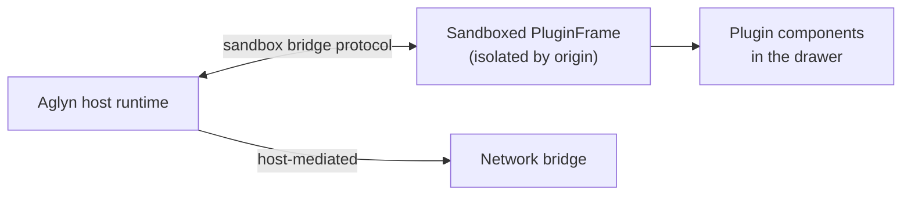

# Plugins & Marketplace

**Plugins** extend Aglyn with new components and capabilities. You install them from the
**community marketplace**, configure them per site, and they run **sandboxed** so they can't
compromise your site.

:::info Plan availability
**Free** to install community plugins; some plugins and marketplace monetization features
are paid.
:::

## Install & upgrade

- Browse the **plugin registry** and install a plugin.
- Installs are **version-pinned**, and you can **upgrade** deliberately.
- Installed plugins appear as named entries in the Besigner **drawer**, alongside built-in
  components.
- Manage everything in one place on the organization's **Plugins & add-ons** page:
  first-party plugin toggles (with release state) plus every marketplace install with
  upgrade, uninstall, and share-with-organization actions.
- Installing enables the plugin for the workspace automatically; uninstalling disables
  it once no site keeps its own pin. **Uninstalling never deletes the data a plugin
  created** — reinstall and it picks up where it left off.

## How plugins run

- Each plugin loads into a **sandboxed PluginFrame** host runtime, isolated by origin.
- A **manifest + sandbox bridge protocol** defines what a plugin can do.
- A **host-mediated network bridge** lets plugins make network calls without direct access
  to your environment.

## Configure

Plugins expose a **settings** field for per-plugin configuration, so the same plugin can
behave differently on each site.

## Publish your own

The **publish + install pipeline** lets developers ship plugins to the marketplace with
version pinning. The community marketplace also supports **paid listings**, Stripe Connect
payouts, and a publisher **ledger**.

## Related

- [The Besigner](../../building-sites/besigner/overview.md)
- [Site templates & block library](../../building-sites/site-templates/overview.md)
- [Building feature plugins](building-feature-plugins.md) — the developer guide to every
  extension surface
- Repo docs: `docs/PLUGIN_LOADING.md` (loading architecture and trust tiers) and
  `docs/PLUGIN_PLATFORM_GAPS.md` (competitive analysis and the v2 roadmap)
