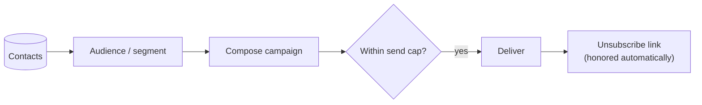

# Email Campaigns

**Email campaigns** let you reach the people in your [contacts CRM](../contacts/overview.md).
Build an audience, compose a send, and Aglyn handles delivery, caps, and unsubscribes.

:::info Plan availability
**Paid**, with **tiered send caps** — how many emails you can send per period depends on
your plan.
:::

## Send a campaign

1. Build an **audience** — a set of contacts, including [segments](../contacts/overview.md#segments)
   used as campaign audiences.
2. Compose the campaign.
3. Send — subject to your plan's **send cap**.

## Compliance

- Every send includes an **unsubscribe** link.
- Unsubscribes are honored automatically so you stay compliant.

## Related

- [Contacts CRM](../contacts/overview.md)
- [Forms & lead capture](../forms/overview.md)
- [Marketing overlays](../marketing-overlays/overview.md) (email capture popups)
