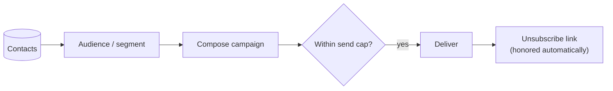

# Email Campaigns

**Email campaigns** let you reach the people in your [contacts CRM](../contacts/overview.md).
Build an audience, compose a send, and Aglyn handles delivery, caps, and unsubscribes.

:::info Plan availability
**Paid**, with **tiered send caps** — how many emails you can send per period depends on
your plan.
:::

## Send a campaign

1. Build an **audience** — leads, site members, [segments](../contacts/overview.md#segments),
   or an **email list**.
2. Compose the campaign from the **Marketing** page.
3. Send — subject to your plan's **send cap**.

### Personalize with merge tags

Use `{{name}}`, `{{firstName}}`, or `{{email}}` anywhere in the subject or body — they
resolve per recipient at send time from the audience's stored details. Add a fallback
with a pipe for recipients without a stored name: `Hi {{firstName|there}}!`.

### Schedule a send

Pick a **Send at** time in the composer and the button becomes **Schedule campaign**.
Scheduled campaigns appear in history with a Scheduled chip and a **Cancel** action
until the send time; they deliver through the same caps, suppression list, and merge
tags as an immediate send.

## Email lists

**Lists** are static audiences shared across your organization's sites. Create them on
the Marketing page, then grow them with the **"Enroll in a list"** automation step (e.g.
on form completion) or popup email capture. Target any list from the campaign composer.

## Experiments

Business plans can A/B test screens, sections, and emails from the **Experiments** card
on the Marketing page: weighted variants, deterministic visitor assignment, a conversion
goal, and per-variant exposure/conversion rates with a pick-the-winner flow.

Two ways to finish a test without watching it:

- **End date** — past it, visitors get the default and stats stop accruing until you
  pick a winner.
- **Auto-declare winner** — opt in with a minimum exposure count per variant and a
  confidence level (90/95/99%); once a challenger clears the bar (or every challenger
  confidently loses to the control), the experiment completes itself and serves the
  winner. Auto-completed tests carry a chip in the results dialog.

- **Screens & sections** — variants pin a screen *version*; visitors are split
  deterministically and the winning version serves to everyone once you pick it.
  Start a section test straight from the Besigner's Interactions panel.
- **Emails** — variants override the campaign's subject and/or body. Attach a running
  email experiment in the campaign composer; each recipient deterministically receives
  one variant (re-sends reach the same variant), sends count as exposures, and once a
  winner is picked every later send uses the winning copy.

## Opens & clicks

With the Resend webhook configured, campaign history shows **opens and clicks** per
campaign, and clicks on A/B sends count as that variant's **conversions** — so the
experiment results table fills in by itself.

## Compliance

- Every send includes an **unsubscribe** link.
- Unsubscribes are honored automatically so you stay compliant.

## Related

- [Contacts CRM](../contacts/overview.md)
- [Forms & lead capture](../forms/overview.md)
- [Marketing overlays](../marketing-overlays/overview.md) (email capture popups)
