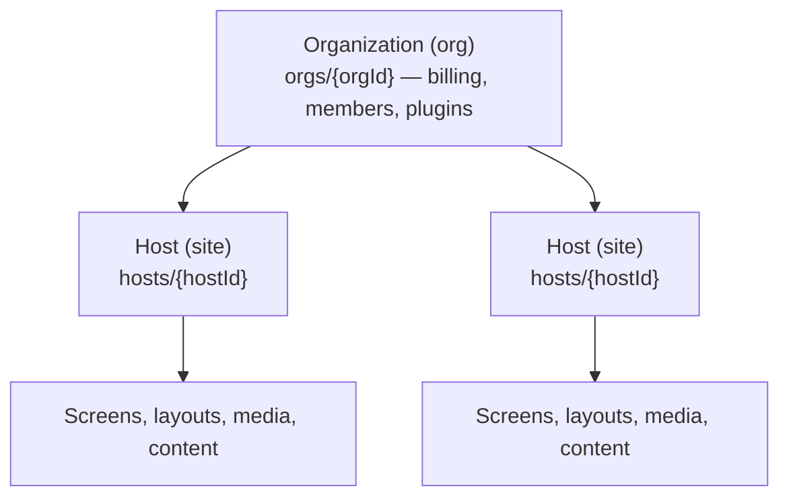

# Glossary & naming conventions

Aglyn's vocabulary grew through a couple of migrations, so several words
name the same thing at different layers. This page is the canonical map
(codified in AGL-443).

## The hierarchy

## Organization (org)

**The entity.** One subscription, one members roster (owner / admin /
editor / viewer), one isolation boundary in Firestore (`orgs/{orgId}`),
one plugin switchboard (`enabledPlugins`), org-scoped shared data
(datasets, contacts, media, installs). Every current API, type, and
permission is org-named: `AglynOrganization`, `resolveOrgPermissions`,
`getOrgForHost`, the console's `/org/*` section.

**Rule: new code that touches the entity says `org`.**

## Workspace

**The same entity, in the user's language.** "Your workspace" is what we
call an organization in UI copy and user docs — Slack-style, including
the `{slug}.aglyn.io` workspace subdomain. It intentionally never names a
collection or a type.

**Rule: `workspace` appears in UI copy and docs only, never in code
identifiers.**

## Tenant

Two meanings — this is the word to be careful with:

1. **The published-site runtime** (current, correct use): `apps/tenant`
   is the app that renders customers' live sites, and the shared
   `@aglyn/tenant-*` libraries serve that side of the platform.
   "Multi-tenant" in architecture prose uses this sense: the org is the
   tenancy boundary.
2. **A historic alias for the org's billing doc** (grandfathered): before
   the organizations migration, billing lived at `tenants/{uid}`. That
   collection is retired, but the org doc mirrors its shape, so the old
   names survive — `AglynTenant`, `useCurrentTenant()`, the `tenant` prop
   on plugin pages, `resolveTenantEntitlements`, `TenantPermissions`. All
   of them carry an **org doc** today. The canonical type name for new
   code is **`AglynOrgBilling`**; `AglynTenant` is `@deprecated` and kept
   because renaming would churn every plugin for zero behavior change.

**Rule: "tenant" is reserved for the site runtime. Never introduce it
for the org entity in new code — take `org` parameters and use
`AglynOrgBilling`.**

## Tenant vs. host — not the same thing

These are the two most-confused terms because both relate to published
sites:

- A **host** is *one site*: `hosts/{hostId}`, with its own domain or
  subdomain, screens, media, and member-role projection. An organization
  owns many hosts ("3 of 15 sites"). In UI copy a host is called a
  **site**.
- The **tenant app** is the *runtime that serves every host*: one
  Next.js deployment that resolves the incoming hostname to a host doc
  (`hostIndex`), loads that host's org, and renders its published
  screens.

So: an org (workspace) owns hosts (sites); the tenant app serves them.
A request to `bakery.example.com` is resolved to a **host**, whose
**org** decides plugins/entitlements, rendered by the **tenant** app.

## Quick reference

| Term | Layer | Names in code | Use for new work |
| --- | --- | --- | --- |
| Organization / org | Data model, APIs, permissions | `orgs/{orgId}`, `AglynOrganization`, `resolveOrg*` | ✅ the entity |
| Workspace | UX / docs | — (copy only) | ✅ user-facing copy |
| Tenant (runtime) | Published-site side | `apps/tenant`, `@aglyn/tenant-*` | ✅ that side of the platform |
| Tenant (billing alias) | Legacy | `AglynTenant`, `useCurrentTenant`, `tenant` props | ⚠️ grandfathered — prefer `AglynOrgBilling` / `org` |
| Host / site | One published site | `hosts/{hostId}`, `AglynHost` | ✅ `host` in code, "site" in copy |
