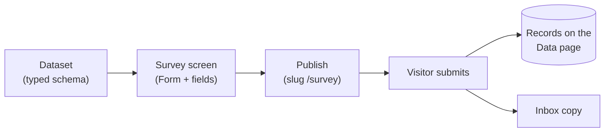

# Build & publish a survey

This walkthrough strings together datasets, the Besigner's form elements, and
publishing into one loop: **model the responses → design the survey → publish →
collect**. By the end you have a live survey page whose submissions land in a
typed dataset you can filter, sort, and export.

<!-- regenerate: node tools/e2e/capture-docs-shots.mjs -->

:::info Plan availability
Forms and the inbox are available on every plan. Writing submissions into a
**dataset** needs the data store, which unlocks on **Starter** and above.
:::

## 1. Create the dataset

Datasets belong to your organization, so every site can share them. Open the
organization **Data** page (or any site's Data page — both edit the same data).

1. Choose **Add dataset**. In the **New dataset** dialog give it a **Name**
   (say `Survey responses`) and an optional comma-separated starting list of
   **Fields** (`satisfaction, visit, topics, comments`). Create it.
2. Select your new dataset in the **Dataset** dropdown and open **Schema**.
   The **Schema** dialog lists each field with its display name, generated
   field id, and a type chip.
3. Use **Add field** / **Edit** to type the fields properly:
   - `satisfaction` → type **Integer** (the star rating submits a number).
   - `visit` → type **Text** (one radio choice).
   - `topics` → type **Text** (ticked checkboxes arrive joined with `, `).
   - `comments` → type **Text**.
4. **Save schema**.

Each field's **Display name** is what you see in dialogs and table headers; the
**field id** next to it (a slug generated once from the display name) is the
stable key records store values under — the key `{{item.fieldId}}` bindings
reference, and what a form field's **Maps to schema field** picker stores.
Renaming the display name later never changes the id.

:::tip Model first
A clean schema now makes everything downstream typed: the record editor renders
the right input per field, imports are validated, and quota-guarded writes
reject junk. See the [datasets deep-dive](datasets-and-schema.md) for the full
type system.
:::

## 2. Add a screen for the survey

1. Go to **Screens** and choose **New screen**.
2. Title it `Survey` and give it the slug `survey` — that becomes its public
   URL path (`https://your-site/survey`).
3. Open it in the **Besigner**.

## 3. Insert a Form from the element picker

With the screen open, add the form:

1. In the Elements panel choose **Add Element** (or right-click a node and pick
   **Add element**). The **Choose element** picker opens, grouped by category.
2. Expand the **Forms** group. It contains the **Form** container, the
   **Form Field** element, and a ready-made **Contact Form** preset.
3. Insert a **Form**. Then, with the Form selected, add one **Form Field**
   child per question (the picker's **Form Field** preset drops a field with
   sensible defaults).

## 4. Configure the fields

Select each Form Field and set its properties in the inspector:

| Property | What it does |
| --- | --- |
| **Field name** | The key the value is stored under in submissions (and in the inbox copy). |
| **Maps to schema field** | Which of the dataset's schema fields this value is stored under. The dropdown lists the fields of the dataset chosen on the Form (see step 5) and stores the stable **field id**, so renaming the field later never breaks the mapping. Left on **None**, the value matches a dataset field by name instead. |
| **Label** | The visible input label ("How satisfied are you?"). |
| **Type** | **Text** (default), **Email**, **Multiline**, **Dropdown**, **Radio choice**, **Checkboxes**, or **Star rating**. |
| **Options** | Choices for dropdown, radio, and checkbox fields — one per line or comma-separated. Ignored by other types. |
| **Required?** | Whether the field must be filled; a required checkbox group needs at least one box ticked. |

:::tip Pick the dataset first
"Maps to schema field" lists the fields of whichever dataset the **Form** is
pointed at — set the Form's **Write to dataset** (step 5) before mapping the
fields, or the dropdown reads *No dataset selected on the form*.
:::

For this survey:

1. `satisfaction` — Type **Star rating**, label "How satisfied are you?". The
   five stars submit a number (`4`).
2. `visit` — Type **Radio choice**, Options `First time, Monthly, Weekly`.
3. `topics` — Type **Checkboxes**, Options `Products, Support, Pricing`.
   Visitors can tick several; the submission joins them with `, `.
4. `comments` — Type **Multiline** for free-form feedback.

## 5. Point the form at the dataset

Select the **Form** container itself and fill its properties:

- **Form name** — identifies the form in your submissions inbox
  (`Visitor survey`).
- **Write to dataset** — pick `Survey responses` from the dropdown, which
  lists your organization's datasets by display name. The form stores the
  dataset's **id**, so renaming the dataset later never breaks the binding.
  Submissions append a record; the inbox always keeps its own copy either way.
- **Submit label** — the button text (defaults to **Send**).
- **Success message** — shown in place of the form after a successful submit.

:::info Rename-safe by id
Both pickers bind by stable id: the Form stores the dataset's document id and
each field's "Maps to schema field" stores the model field id. Rename the
dataset or its fields freely — records keep landing. Unmapped values still
match schema fields **by name** (field name = field id); values that match
nothing are dropped from the record (the inbox copy still has everything).
Forms built before the pickers keep working through their stored dataset
name — shown as **Write to dataset (legacy name)** until you pick the dataset
above and clear it.
:::

## 6. Publish

Click **Publish** in the Besigner's top-right (it flips to **Unpublish** once
live). If the screen has no URL path yet you're prompted to set one first. The
survey is now served at `/survey` on your site's domain.

## 7. Watch responses arrive

Every submission does three things:

- appends a **record** to `Survey responses` — the Data page updates live;
- files an **inbox copy** under the form's name (see
  [Forms & lead capture](../content-and-data/forms/overview.md));
- fires the `formSubmission` automation event, so
  [workflows and actions](../marketing-and-automation/workflows-and-actions/overview.md)
  can react (send a thank-you alert, notify your team, write other datasets).

On the Data page, use **Filter** (`satisfaction >= 4`) and **Sort**
(`satisfaction desc`) over the loaded records, and export everything with the
**CSV** / **JSON** buttons.

:::tip Chart it
Bind a container's **Repeat over dataset** to `Survey responses` and reference
`{{item.satisfaction}}` inside it to render responses back onto a
(members-only?) results screen. The [deep-dive](datasets-and-schema.md#repeatables)
covers repeatables.
:::

## Related

- [Datasets & schema deep-dive](datasets-and-schema.md)
- [Forms & lead capture](../content-and-data/forms/overview.md)
- [Publish your first screen](../getting-started/publish-your-first-screen.md)
- [Workflows & actions](../marketing-and-automation/workflows-and-actions/overview.md)
