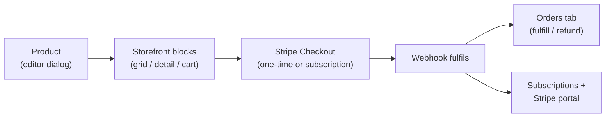

# Commerce end to end

This walkthrough runs the whole selling loop: **catalog → storefront → checkout
→ orders → subscriptions**. It links into the
[commerce reference](../commerce-and-bookings/commerce/overview.md) rather than
repeating it — the goal here is the end-to-end path.

<!-- regenerate: node tools/e2e/capture-docs-shots.mjs -->

:::info Plan availability
Selling needs a **paid** plan (fees drop as you upgrade — see
[Billing & plans](../workspace-and-billing/billing-and-plans/overview.md)).
Storefront **subscriptions** (including the subscribe side of
"Both — buyer chooses") need **Business** and above.
:::

## 1. Connect payments

Aglyn sells from **your own Stripe account** via Stripe Connect. On the
**Products** hub, the payments card walks you through Express onboarding;
checkout stays disabled ("This site has not enabled payments yet") until
Stripe reports charges enabled. Aglyn adds its per-sale platform fee
automatically per your plan.

## 2. Create products

On the site's **Products** page (Catalog tab), choose **Add product**. The
editor dialog covers everything the
[catalog reference](../commerce-and-bookings/commerce/catalog.md) describes:

- **Basics** — Name, Slug (`/products/{slug}`), Type (**Physical / Digital /
  Service**), Status (**Draft / Active / Archived**), description, tags,
  categories, media.
- **Options & variants** — up to 3 options expand into a variants matrix with
  per-variant **Price**, **Compare-at**, **SKU**, **Barcode**, **Stock**, and
  **Weight**. Blank stock = untracked; `0` shows sold out.
- **Billing** — how buyers pay:
  - **One-time purchase** (default) — a normal order.
  - **Monthly subscription** / **Yearly subscription** — the product page
    prices per interval and the buy button becomes **Subscribe**.
  - **Both — buyer chooses** — the product page shows a one-time vs subscribe
    toggle (defaulting to one-time); pick the **Interval** the subscribe side
    bills at. The buyer's choice is validated server-side against the product.
  - Any subscription mode reveals **Free trial (days)** — the trial precedes
    the first charge.
- **Digital delivery** (digital products) — attach files from the media
  library, optionally versioned, with a per-order **Download limit**. Buyers
  always download the current files; uploading a new version re-delivers.

Set the product's Status to **Active** — drafts are invisible to visitors.

## 3. Design the storefront

Open a screen in the Besigner and add blocks from the **Commerce** group of
the element picker:

- **Product grid** — a responsive catalog grid. Its **Show** property scopes
  it to all products, a collection, a category, or a tag; set **Columns**,
  **Sort**, a cap, and optional visitor-facing filter chips. Cards link to
  `/products/{slug}`.
- **Product detail** — gallery, variant picker, price (with sale badge, trial
  caption, and `/mo`·`/yr` when subscribing), **Add to cart**, and the buy
  button (**Buy now** / **Subscribe**, or the one-time-vs-subscribe toggle for
  "Both" products). Leave its **Product slug** blank on a template screen so
  it follows the URL. The **Product page** preset drops the whole
  commerce-standard page in one go: a `Shop / {{product.name}}` breadcrumb,
  the detail block, a *You may also like* strip, and product reviews.
- **Cart** — two presets: a **Cart button** (app-bar icon with an item-count
  badge and a slide-out drawer — the badge updates live as blocks add to the
  cart) and a **Cart page** (inline, with coupon and gift-card fields). Both
  end in a **Checkout** button.

### Catalog search, filters, and sort

The Product grid carries a toggle per storefront catalog control, so a bare
strip on the home page and a full shop page are the same block:

- **Search box** — a debounced search field above the grid; matches product
  names, descriptions, and tags.
- **Category chips** — one chip per product category (plus **All**), built
  from the categories you manage in the Products hub. Visitors tap to filter.
- **Sort select** — newest, name, price low→high, price high→low,
  right-aligned above the grid.
- **Type filter** — physical / digital / services chips, useful for mixed
  catalogs.
- **Price filter** — a two-thumb price range slider, automatically bounded
  by the lowest and highest prices among the products currently showing
  (variant-priced products count by their "From" price). Visitors drag
  either end to narrow the range.
- **Page size** — products per page with a **Load more** button; leave blank
  to load once (**Max items** still caps the grid either way).

Everything resolves server-side through the catalog API — searching and
filtering stay fast on large catalogs, and the browser never downloads the
whole catalog. The **Shop catalog** preset inserts the grid with search,
categories, sort, and paging already on.

### Category pages

Two ways to give every category a browsable page:

- **Pinned grid** — set a grid's **Show** to *A category* and pick the
  category, then place it on its own screen (say `/apparel`). The category is
  stored by id, so renaming it later never breaks the page. With **Category
  chips** on, the pinned category is the initial filter and visitors can
  still hop to a sibling category or back to **All** from the same grid.
- **Collection template** — design one screen with a Product grid whose
  collection is left blank and set it as the **Collection page template**
  (store settings): every `/collections/{slug}` URL renders that screen
  scoped to its collection.

### The product page template

Individual product URLs (`/products/{slug}`) render through a **template
screen**: design a screen containing a **Product detail** block, then set it
as the **Product page template** in the Products hub's **Settings** tab (store
settings). The server composes that screen per product — `{{product.name}}`,
`{{product.price}}`, and friends resolve, and product SEO/structured data is
injected. Without a template, product URLs 404. A sibling **Collection page
template** does the same for `/collections/{slug}`.

## 4. What checkout does

Both buy buttons and the cart's **Checkout** redirect to **Stripe-hosted
Checkout**, then back to your site with a success/cancelled marker:

- Prices are always re-read from your catalog server-side — the browser can't
  alter them.
- **One-time** purchases (and *all* cart checkouts) create a payment; the
  webhook then creates the order, decrements stock, sends receipts, mints
  gift-card codes, assigns license keys and download links, and routes
  dropship suppliers.
- **Subscription** checkouts (from the product page of a subscription or
  "Both" product) create a recurring Stripe subscription — with the trial you
  configured — and record it on the site. The cart never sells subscriptions;
  recurring products subscribe through their product page.

## 5. Run orders from the console

The **Products** hub's **Orders** tab lists every sale with product, period,
status, and channel filters plus **Export CSV** and **Draft order** (build an
order by hand and send a payment link).

Open an order for the detail dialog — customer, line items, totals, timeline,
and internal notes:

- **Fulfill…** — enter a carrier and tracking number; the order moves to
  fulfilled and the buyer's account page shows the tracking. **Mark
  delivered** closes the loop, and **Packing slip** prints one.
- **Refund** — confirms *"Refund this order?"*, then refunds the buyer through
  Stripe (full or partial) and reverses the platform fee. Site-**admin** role
  only.
- **Cancel order** — for orders that shouldn't proceed (does not auto-refund).

Statuses move through a guarded machine: pending → paid → fulfilled →
delivered, with cancel/refund exits — see the
[orders reference](../commerce-and-bookings/commerce/overview.md#orders).

## 6. Subscriptions & the Stripe portal

Active subscriptions are recorded per site and surface in two places:

- **Buyers** manage their own — the
  [Customer account block](member-accounts.md#2-design-an-account-page)'s
  **Subscriptions** section has a **Manage** button that opens the **Stripe
  Billing Portal** (update card, cancel, see invoices).
- **You** see each member's subscriptions (with renewal dates) in the member
  drawer on the site's **Users** page, and managers get a *New subscriber*
  notification on each signup.

An active subscription is also what
[members-only content](../workspace-and-billing/teams-and-roles/members-only.md)
can check for paid gating.

## Related

- [Commerce reference](../commerce-and-bookings/commerce/overview.md)
- [Product catalog](../commerce-and-bookings/commerce/catalog.md)
- [POS & reservations](../commerce-and-bookings/commerce/pos-and-reservations.md)
- [Member accounts](member-accounts.md)
