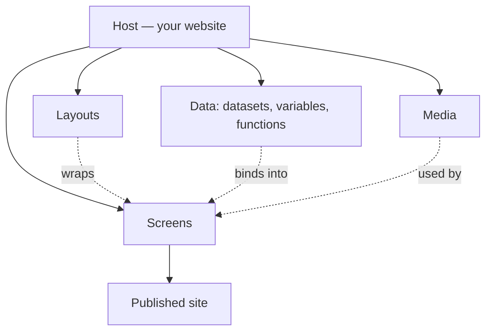

# Welcome to Aglyn

Aglyn is a no-code platform for building and running websites. You design pages
visually in the **Besigner**, bind them to your own data, and publish to a fast,
SEO-ready site — all without writing code.

These docs teach you how to actually *use* Aglyn, feature by feature. If you're new,
start with **[Getting Started](getting-started/create-a-host.md)**. If you're catching
up on what shipped recently, see **[What's New](whats-new.md)**.

## The mental model

A few concepts show up everywhere in Aglyn. Learn these first and the rest of the
product clicks into place.

| Concept | What it is |
| --- | --- |
| **Host** | Your website — its screens, theme, data, domain, and settings. You can own more than one. |
| **Screen** | A page. Screens have a URL slug, live in a hierarchy, and are edited in the Besigner. |
| **Layout** | A shared frame (header/footer/nav) that many screens render inside via a layout **slot**. |
| **Besigner** | The visual editor. Drag components onto a canvas, arrange a hierarchy, and edit text inline. |
| **Component** | A building block on the canvas (Button, Image, Video, Form, and more). Can be made **reusable**. |
| **Binding** | A live reference in a text prop — `{{variable}}`, `{{fn:name(args)}}`, or a dataset field — resolved at render time. |
| **Dataset** | Structured content (a typed model with records) that screens read from and forms write to. |
| **Plan & entitlements** | Your subscription tier gates features and quotas (Free, Pro, Business). |

## How the docs are organized

- **Getting Started** — create a host and publish your first screen.
- **What's New** — the features shipped most recently, with links into each area.
- **Feature areas** — one section per part of the product (Besigner, Datasets, Media,
  Commerce, and so on), each with an overview and task-based how-tos.

:::tip Plan gating
Many features are gated by your plan. Where that matters, a page starts with a callout
like the one below.
:::

:::info Plan availability
**Free** for core building. **Pro** and **Business** unlock advanced features — each page
notes what it needs.
:::

Ready? Head to **[Create your first host](getting-started/create-a-host.md)**.
