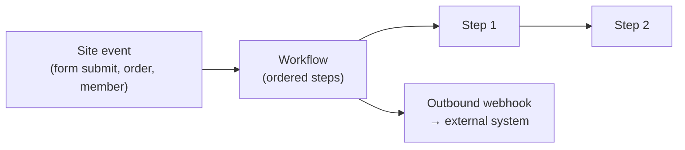

# Workflows, Actions & Webhooks

Automate what happens on your site. **Workflows** run multi-step logic when something
happens; the **actions builder** maps an event to an action; **webhooks** connect Aglyn to
outside systems.

:::info Plan availability
**Pro+** for actions and workflows (metered runs per tier). **Webhooks** are **Business**.
:::

## Workflows

- Build workflows on the **workflows page** with a pure step runner.
- Trigger them from **site events**, and compose [functions and variables](../../building-sites/bindings/overview.md)
  inside them.
- Runs are **metered** per tier.

## Actions builder

The **actions builder** turns an event into an action — event → action automation without
code. Available on **Pro+** with metered runs.

## Webhooks

**Outbound** and **inbound** webhooks let Aglyn notify other systems and receive events from
them. Webhooks are a **Business**-tier feature.

:::note More detailed how-tos coming
Recipes for common automations (notify on form submit, sync orders, etc.) are on the way.
:::

## Related

- [Bindings, variables & functions](../../building-sites/bindings/overview.md)
- [Billing & plans](../../workspace-and-billing/billing-and-plans/overview.md)
