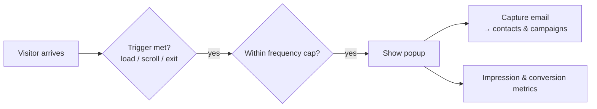

# Marketing Overlays

**Marketing overlays** are the announcement bars and popups that sit on top of your site to
promote offers and capture emails — without touching your page designs. Manage them from
your site's **Marketing** page.

:::info Plan availability
**Paid**, gated by the `marketingOverlays` entitlement.
:::

## Announcement bar

A **site-wide announcement bar** shows a message across every page — ideal for sales,
notices, or launches. It's controlled centrally and gated by the marketing-overlays
entitlement.

## Promotional popups

Popups give you more control:

- **Triggers** — show on load, on scroll, on exit intent, and similar.
- **Frequency capping** — don't nag returning visitors.
- **Scheduling** — run a popup only during a campaign window.

### Popup v2

The latest popup adds:

- **Email capture** — collect emails straight into your [contacts](../contacts/overview.md)
  and [campaigns](../email-campaigns/overview.md).
- **Overlay metrics** — impressions and conversions for each overlay.
- A **media picker** so popups can use images from your [media library](../media/overview.md).

## Multiple overlays, scheduling & page targeting

The **Marketing** page manages any number of bars and popups, each with:

- A **schedule window** (show from / show until) — run a bar only during a sale.
- **Page targeting** — comma-separated paths, with `/blog/*` matching a whole section,
  plus a "never show on" exclude list.
- An **enable switch** and a status chip (Live / Scheduled / Off).

When several overlays match a page, the first bar and the first popup (by order) show.
The single announcement bar and popup on the same page remain as your always-on default
surfaces; configured overlays take priority over them.

## Related

- [Email campaigns](../email-campaigns/overview.md)
- [Contacts CRM](../contacts/overview.md)
- [Billing & plans](../billing-and-plans/overview.md)
