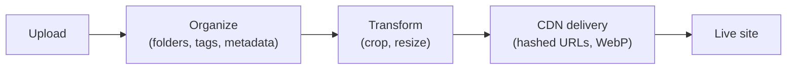

# Media Library & CDN

The **media library** stores your images, video, and files, keeps them organized, and
serves them quickly. Media plugs into components like **Image** and **Video** and into the
theme's favicon.

:::info Plan availability
**Free** with storage quotas. **CDN delivery** with WebP variants is a **paid-tier**
feature; large video uploads and higher storage are gated by plan.
:::

## Organize

- Arrange media in a **folder hierarchy** with a drag-and-drop folder rail.
- Filter by **type, date, and size**, and sort the library.
- Capture and edit **metadata**; bulk-edit selections in a detail drawer.
- See **per-asset usage** — where each asset is referenced, plus delivery counters.

## Upload

- Upload **images**, **video**, and **PDFs**, with tiered size caps.
- Large video (up to 200MB) uses **signed-URL uploads** so big files go straight to
  storage.
- Rename, **replace the file** behind an asset, and apply **image transforms**.

## Deliver over CDN

Paid tiers serve media via a **CDN** with hashed URLs and automatic **WebP variants**, so
images load fast and cache well.

## Components

- **Image** — place and bind images from the library.
- **Video** — embed uploaded video.
- **Favicon picker** — choose the site favicon from your media.

## Related

- [Bindings](../bindings/overview.md)
- [SEO toolkit](../seo/overview.md) (Open Graph & Twitter images)
