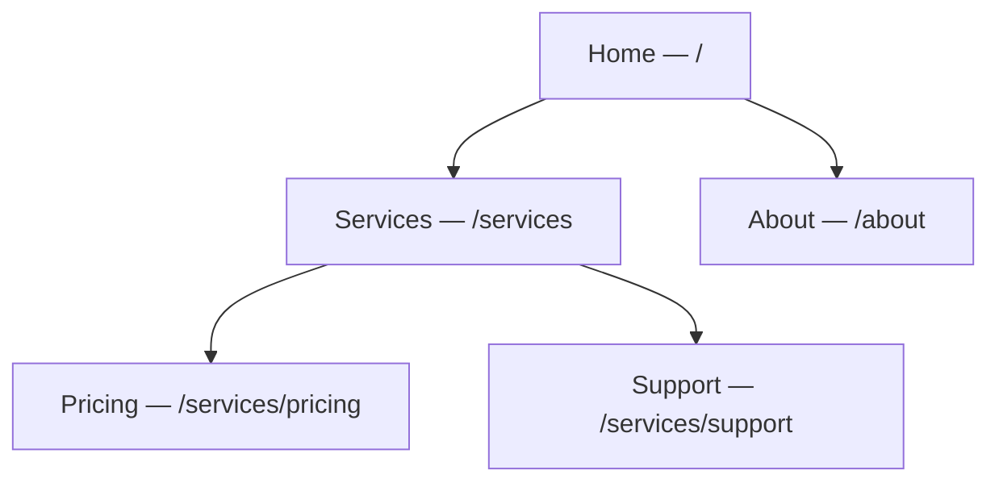

# Screens & Layouts

Screens are your pages; layouts are the shared frames they render inside. Together they
define your site's structure, URLs, and reusable chrome.

The screen hierarchy maps directly to your URL paths:

:::info Plan availability
**Free** for core screens and layouts. Higher tiers raise caps on screens, versions, and
reusable components.
:::

## Screens & routing

- Each screen has a **title** and a URL **slug**. Aglyn normalizes slugs and keeps a
  host **routing map**.
- Screens form a **hierarchy**: pick a parent and the child inherits a nested path
  (`/services/pricing`). Changing a slug or parent cascades safe rewrites across the map,
  with cycle guards so you can't create a loop.
- Reorder the hierarchy with **drag-and-drop** in the screens list.

## Layouts

A **layout** is a shared frame (header, nav, footer) with a **slot** where screen content
renders. Bind a screen to a layout in the Besigner and the layout chrome wraps the screen
both in the editor and on the published site. Layouts have their own versions and admin
converters, just like screens.

## Reusable components

Promote a subtree into a **reusable component** and insert instances anywhere. Instances
graft the source at render time, so one edit updates them all. Manage (rename / demote /
delete) reusable components from the host dashboard.

## Versions & scheduled publishing

- Save **named versions** of a screen or layout.
- **Schedule** a version to publish at a future time.
- Delete versions you no longer need.
- The **version dropdown** lives in the app bar near your avatar for quick switching.

## Error & maintenance screens

You can design custom **404 / 401 / 403 / 503** screens and turn on **maintenance mode**.
See [Site protection & error pages](../site-protection/overview.md).

## Related

- [The Besigner](../besigner/overview.md)
- [Bindings & variables](../bindings/overview.md)
- [SEO toolkit](../seo/overview.md)
