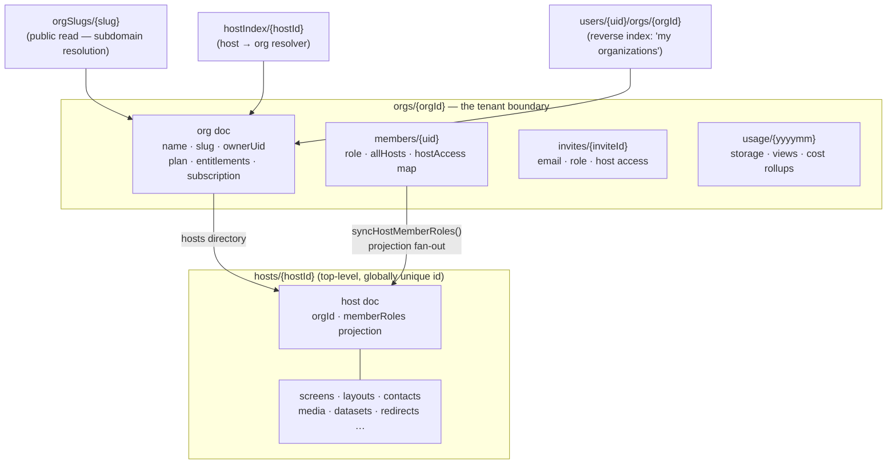
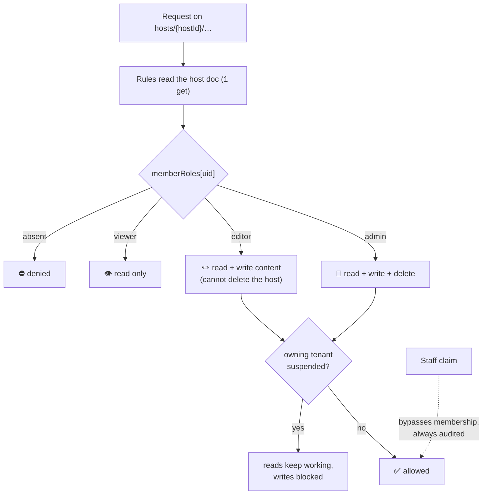
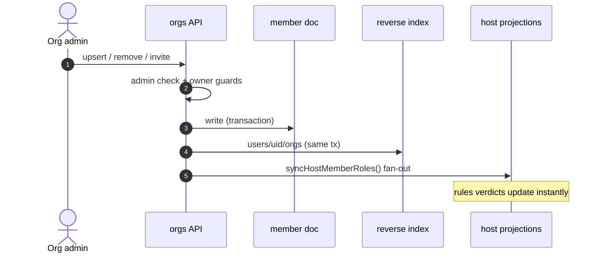
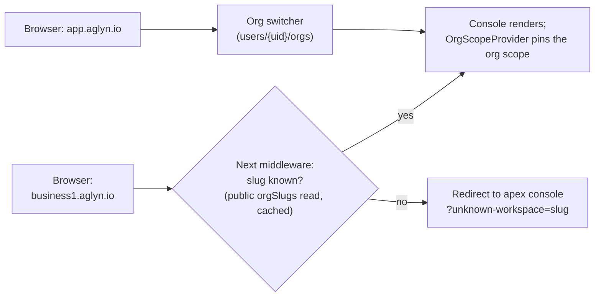
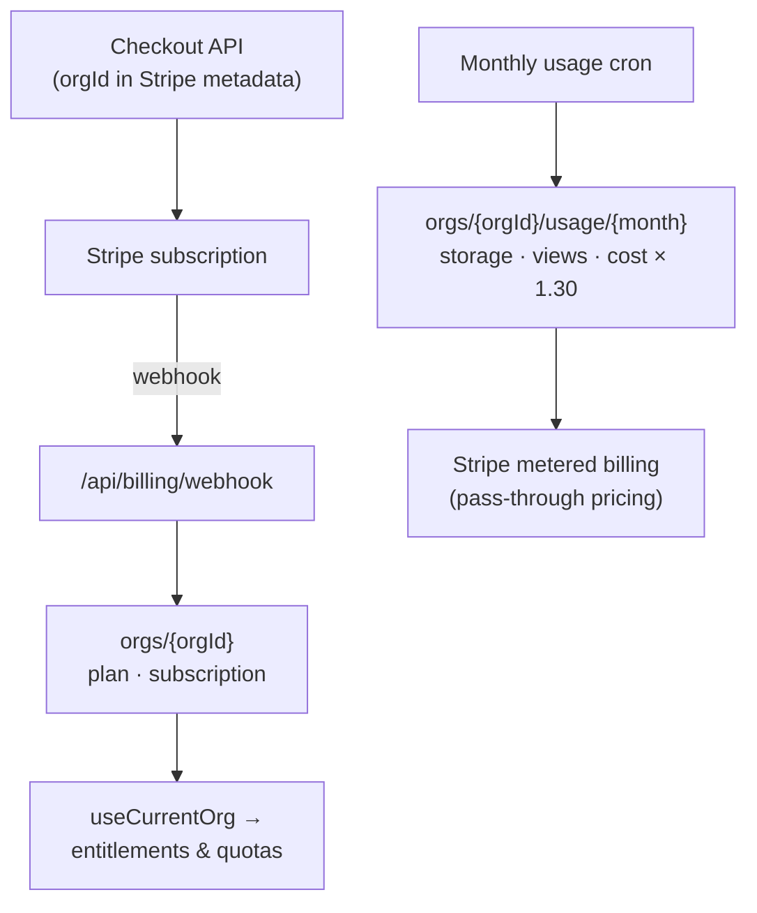

# Architecture: Multi-Tenant Organizations

:::warning Aglyn staff only
Internal architecture reference for the organization tenancy model (Linear project
*Multi-Tenant Organizations & Firestore v2*; the full design doc lives in the repo at
`docs/MULTI_TENANT_FIRESTORE.md`).
:::

## The model in one sentence

**An organization is the tenant**: one subscription, one workspace subdomain, one
isolation boundary — owning any number of hosts (websites), with people belonging to
many organizations under different roles.

## Data model

Everything lives in one Firestore database. Isolation comes from membership documents
and server-maintained projections, never from client-side query discipline:

Two deliberate choices:

- **Hosts stay top-level.** Host ids are the console's route params and the tenant
  renderer's lookup keys; `hostIndex` resolves a host's org without knowing it. The
  isolation the design wanted from ancestry nesting comes from the projection below.
- **Reverse index over collection-group queries.** "List my orgs" is one cheap
  collection read under the user's own doc — no composite indexes, no cross-org scans.

## Authorization: one read per request

Security rules never do more than one extra document read. For host content that read is
the host doc itself, which carries a **`memberRoles` projection** — a map of
`uid → admin | editor | viewer` recomputed by the org APIs whenever membership changes:

Org-level roles feed that projection:

| Org role | Org settings | Members & invites | Create hosts | Host access |
|----------|--------------|-------------------|--------------|-------------|
| owner    | ✓ (incl. delete) | ✓ | ✓ | admin on all hosts |
| admin    | ✓ | ✓ | ✓ | admin on all hosts |
| editor   | — | — | — | per `hostAccess` / `allHosts` |
| viewer   | read-only | — | — | read per `hostAccess` / `allHosts` |

Billing, suspension, slugs, membership and the projections are **Admin-SDK-only** —
security rules deny every client write, so the invariants can't drift from the browser.
A 13-case emulator matrix (`npm run test:rules`) locks this behavior in; it caught a
rules-v2 wildcard subtlety (zero-segment `{document=**}` matching the host doc itself)
before it shipped.

## Membership lifecycle

All mutations flow through API routes so three places stay consistent — the member doc,
the reverse index, and every affected host's projection:

Invites follow the same path: an org admin records the invite, the invited person signs
in with a **verified matching email** and accepts, which materializes the membership
through the identical transaction + fan-out.

## Workspace subdomains

Each org gets a Slack-style workspace address. Host sites keep their own domains — the
workspace subdomain scopes the **console**, not published sites:

The middleware is inert until ops sets `NEXT_PUBLIC_WORKSPACE_DOMAIN` beside the
wildcard domain. Organizations are the permanent tenancy model (not release-flagged):
every account operates inside an org, and the switcher appears as soon as a user
belongs to one.

## Billing & cost attribution

Plans and entitlements live on the **org doc** — the uid-keyed `tenants`
collection retired with the AGL-238 cutover. The Stripe webhook writes org docs
only, and every entitlement, quota, and suspension check resolves host → org:

Per-org usage rollups are what keep the freemium model affordable: every org's floor
cost is a handful of Firestore reads per session (one membership/host-doc read per
request, reverse index instead of scans), and anything metered is attributed to the org
that caused it.

## Related

- [Feature flags](./feature-flags.md) — the release-gating system the workspace UX
  ships behind.
- [Teams, Roles & Membership](../teams-and-roles/overview.md) — the customer-facing
  view of the same membership model.
- `docs/MULTI_TENANT_FIRESTORE.md` (repo) — full design doc with the migration plan
  and open questions.
