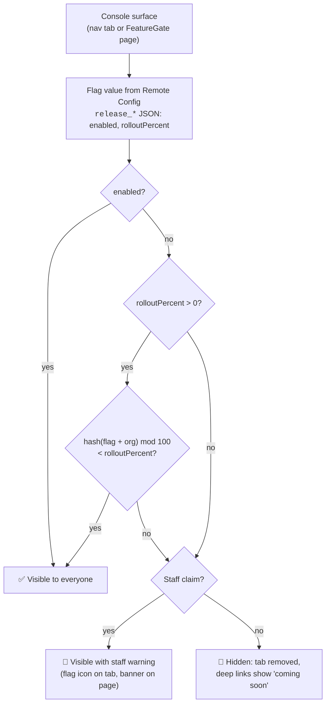
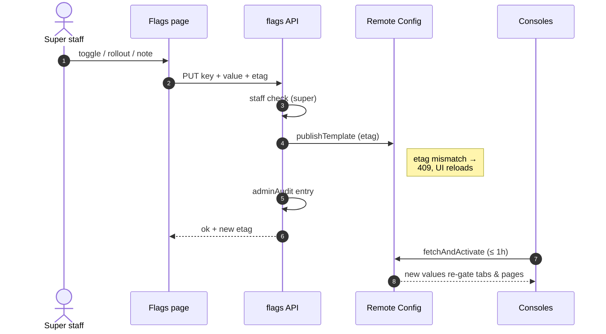

# Feature Flags (release gating)

:::warning Aglyn staff only
Feature flags are managed from the staff console and require a staff claim; publishing
changes requires the **super** staff role.
:::

Release flags control whether a feature is **launched** — a separate axis from
[plan entitlements](../workspace-and-billing/billing-and-plans/overview.md), which control whether an organization's
*plan includes* a feature. A customer sees a feature only when it's released **and**
their plan allows it.

## How a flag is evaluated

Every check runs client-side against the activated Remote Config template, with the
registry's code defaults as the offline fallback:

The rollout hash is seeded with the **flag key and the organization**, so a workspace keeps a
stable verdict across sessions and different flags don't share buckets.

## How gating behaves

- **Customers** with a flag off don't see the feature: its dashboard tab disappears and
  deep links show a "coming soon" notice instead of the page content.
- **Staff always see every feature.** A flagged-off feature is marked with a flag icon on
  its nav tab and a warning banner on the page, so an unreleased surface is never mistaken
  for a launched one.
- **Percentage rollout**: a flag that's off can be rolled out gradually. The verdict is
  deterministic per workspace (hashed from the org), so a workspace keeps the feature
  once its bucket is inside the rollout percentage — no flapping between sessions.

## Managing flags

Open **Staff → Feature flags**. Each registered flag shows its live value from Firebase
Remote Config:

- **Toggle** — on for everyone, or off (with optional rollout).
- **Rollout slider** — 0–100% of workspaces while the flag is off.
- **Note** — free-form context ("waiting on AGL-199", owner, launch date).

Publishing is immediate and global: clients pick up changes on their next Remote Config
fetch (within an hour, or on the next full page load). Every publish writes an entry to
the [audit log](overview.md), and concurrent edits are etag-guarded — if another staff
member published first, the page reloads the latest values instead of overwriting them.

Reads are open to all staff roles; publishing requires the **super** role, matching user
management.

## Under the hood

- Flags live as JSON parameters (`release_*`) in the Firebase Remote Config template;
  `cloud/firebase-remoteconfig.template.json` seeds them
  (`firebase deploy --only remoteconfig`).
- The registry of flags — keys, labels, code-side fallback defaults, and which nav tab
  each governs — is versioned in `@aglyn/aglyn` (`release-flags.ts`). Adding a flag means
  adding a registry entry, seeding the template, and wrapping the page in `<FeatureGate>`.
- If Remote Config is unreachable, the registry defaults gate — a default-off feature
  never flashes on while offline.
